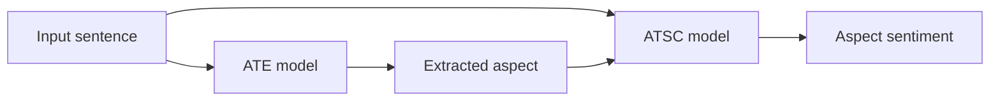

# ABSA-BERT

Aspect-Based Sentiment Analysis with BERT and PyTorch.

ABSA-BERT implements a two-stage pipeline that first identifies aspect terms in
a sentence and then predicts the sentiment expressed toward a selected aspect.
The repository includes training scripts, single-example inference commands,
dataset analysis utilities, tests, and a production-oriented Docker image.

## Overview

| Task | Purpose | Model output |
| --- | --- | --- |
| Aspect Term Extraction (ATE) | Locate aspect terms in a sentence | Token-level BIO labels |
| Aspect-Term Sentiment Classification (ATSC) | Classify sentiment toward a given aspect | Negative, neutral, or positive |

Both tasks fine-tune `bert-base-uncased` by default:

- **ATE:** BERT token representations followed by a linear sequence-labeling head.
- **ATSC:** BERT's pooled `[CLS]` representation followed by a linear classification head.



## Requirements

- Python 3.10 or later
- [`uv`](https://docs.astral.sh/uv/) for the recommended setup
- CUDA-compatible GPU for faster training, or CPU for development and inference

The first model run downloads the pretrained BERT tokenizer and weights from
Hugging Face.

## Quick Start

Clone the repository and install the project with its development dependencies:

```bash
git clone https://github.com/GiangGG1116/ABSA-BERT.git
cd ABSA-BERT
uv sync --extra dev
```

The repository includes restaurant review data under `data/data/`. Train both
models with:

```bash
uv run absa-train-ate \
  --train_csv data/data/restaurants_train.csv \
  --valid_csv data/data/restaurants_test.csv \
  --save_dir outputs/ate

uv run absa-train-atsc \
  --train_csv data/data/restaurants_train.csv \
  --valid_csv data/data/restaurants_test.csv \
  --save_dir outputs/atsc
```

Each command automatically uses CUDA when available and saves the checkpoint
with the lowest validation loss as `<save_dir>/best.pt`.

Run inference:

```bash
uv run absa-predict-ate \
  --ckpt outputs/ate/best.pt \
  --sentence "The food was great but the service was slow."

uv run absa-predict-atsc \
  --ckpt outputs/atsc/best.pt \
  --sentence "The food was great but the service was slow." \
  --aspect "food"
```

ATE inference returns WordPiece tokens and their predicted label IDs. ATSC
inference returns the predicted label ID and its sentiment name.

## Dataset Format

Training and validation data must be CSV files whose first three columns contain
Python-style list strings:

| Column | Description | Label values |
| --- | --- | --- |
| `Tokens` | Tokenized sentence | String tokens |
| `Tags` | BIO label for each token | `0`: outside, `1`: beginning, `2`: inside |
| `Polarities` | Sentiment label for each token | `-1`: not an aspect, `0`: negative, `1`: neutral, `2`: positive |

Example:

```csv
Tokens,Tags,Polarities
"['The', 'bread', 'is', 'excellent']","[0, 1, 0, 0]","[-1, 2, -1, -1]"
```

The number of values in `Tags` and `Polarities` should match the number of
values in `Tokens`.

To use custom data, pass its paths through `--train_csv` and `--valid_csv`.
The helper script at `scripts/download_data.sh` is a template and requires a
valid Google Drive file ID before use.

## Training Configuration

Both training commands expose the same core options:

| Option | Default | Description |
| --- | ---: | --- |
| `--model_name` | `bert-base-uncased` | Hugging Face model identifier |
| `--epochs` | `5` | Number of training epochs |
| `--batch_size` | `32` | Batch size |
| `--lr` | `1e-5` | AdamW learning rate |
| `--weight_decay` | `0.01` | AdamW weight decay |
| `--grad_clip` | `1.0` | Maximum gradient norm |
| `--max_length` | `128` | Maximum tokenized sequence length |
| `--seed` | `42` | Random seed |
| `--save_dir` | Task-specific | Checkpoint output directory |

For the complete command reference:

```bash
uv run absa-train-ate --help
uv run absa-train-atsc --help
```

## Data Analysis

Generate summary statistics for the train and validation splits:

```bash
uv run absa-analyze-data \
  --train_csv data/data/restaurants_train.csv \
  --valid_csv data/data/restaurants_test.csv \
  --out_json outputs/data_analysis.json
```

The report includes row counts, duplicates, sentence-length statistics, aspect
counts, polarity distribution, and vocabulary size.

## Development

Run the test suite and code-quality checks:

```bash
uv run pytest
uv run ruff check src tests
uv run ruff format --check src tests
```

Equivalent Make targets are also available. Because their dataset defaults point
to `data/raw/`, provide the bundled dataset paths explicitly:

```bash
uv run make train-ate \
  TRAIN_CSV=data/data/restaurants_train.csv \
  VALID_CSV=data/data/restaurants_test.csv

uv run make test
uv run make lint
```

## Current Scope

- Inference commands process one example at a time.
- ATE inference exposes token-level label IDs; post-processing them into
  human-readable aspect spans is not yet included.
- Training selects checkpoints by validation loss and does not currently export
  task-specific evaluation reports.
